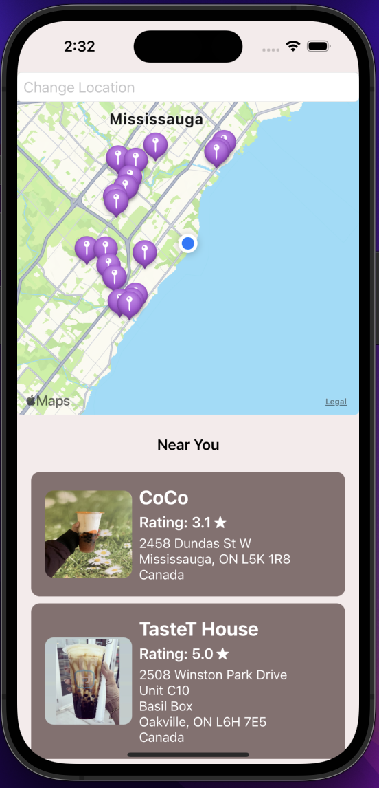
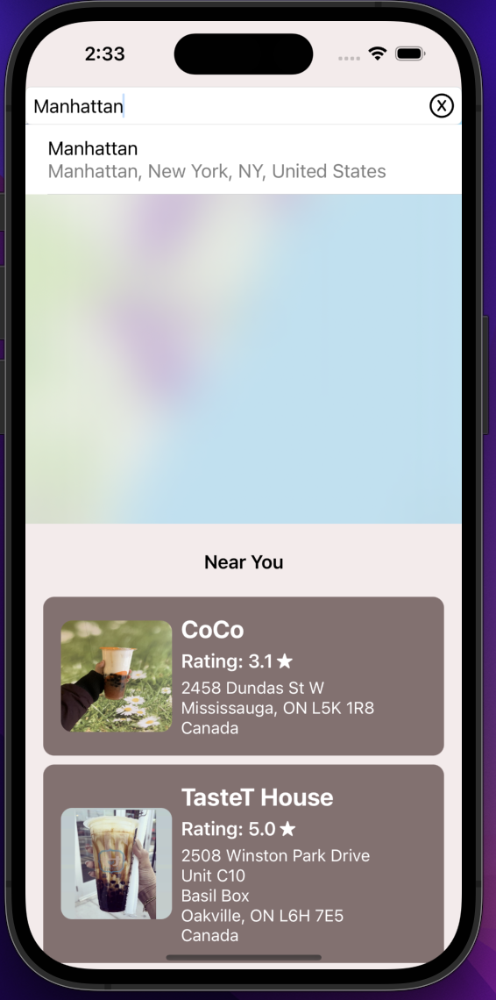
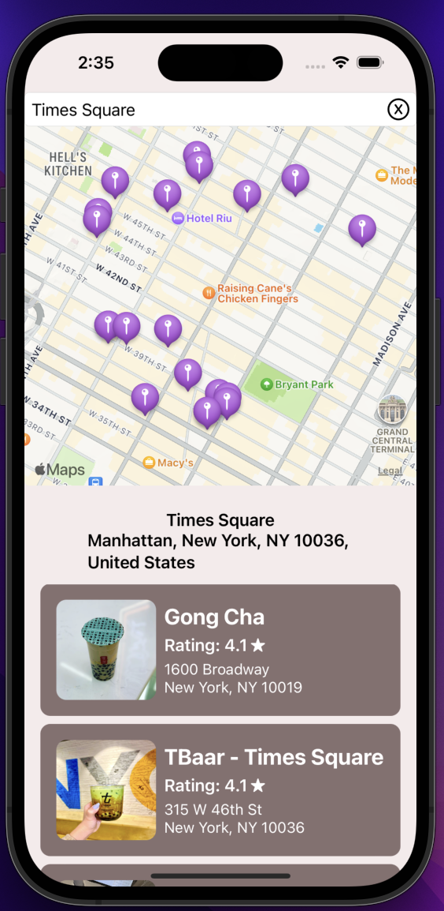

# Boba Time
An iOS application built with SwiftUI that helps you find nearby bubble tea shops based on your geographical location or an address you input. Utilizing MapKit and the Yelp Fusion API, Boba Time provides a seamless and user-friendly experience to locate your favorite boba spots. Proud winner at DeerHacks.

## Features
- **Real-time Location**: Automatically detects your current location to find nearby bubble tea shops.
- **Search by Address**: Allows you to input any address to search for nearby boba spots.
- **Map Integration**: Displays results on an interactive map using MapKit.
- **Detailed Information**: Provides detailed information about each shop, including ratings and contact information.
- **User-Friendly Interface**: Simple and intuitive SwiftUI design for a smooth user experience.

## Demo

  
  
  

## Yelp Fusion API Integration
To use the Yelp Fusion API, you need to get an API key at [Yelp Developers](https://docs.developer.yelp.com/docs/fusion-intro)
- Sign up for a Yelp account and create an app to get your API key from Yelp Developers.
- Add your API key to the `DataService` file
